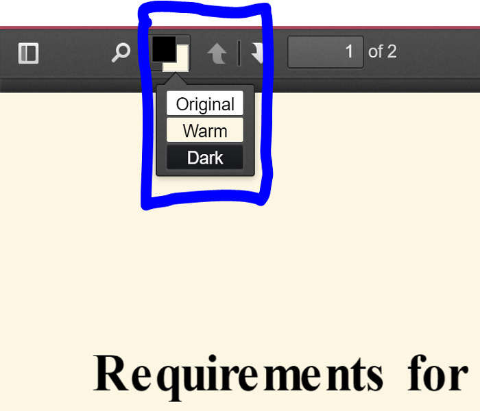
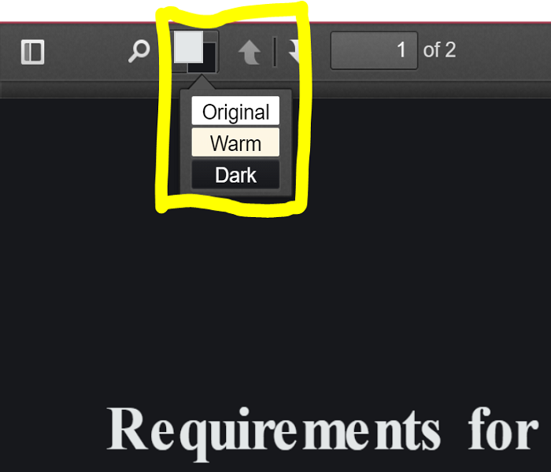

# Invertor

Invertor is a Chrome extension for viewing PDF documents in multiple color themes.

It's based on Mozilla's project [PDF.js](https://github.com/mozilla/pdf.js) for displaying documents in Chrome. The color theme of the PDF can be switched between `Original`, `Dark` and `Warm`.

The original inspiration of this project is to provide better eye protection to people who read PDFs on monitors for long period of time. Moreover, this project is currently planned to improve On-Monitor reading experience by providing extra book-like operations. So that when you use Invertor, you feel like you're physically reading a real book.

Currently, the changes only happened to displaying the document. You can build the project by running the commands given in [PDF.js](https://github.com/mozilla/pdf.js).

## Basic Commands

Run

    $ gulp server

at the root directory of this repo to start the server on your local machine, then open

+ http://localhost:8888/web/viewer.html

to view the sample documents in your browser.

## Overview of the extra functionality provided by this project

Beside the existing functionality of PDF.js, Invertor added one component on the top bar of the viewer. Beside the `search` button (the magnifier-shaped icon), the button that looks like the classic color palette button in Photoshop is the `color theme` button. Click it you will have three themes to choose from. `Original`, `Warm` and `Dark` correspond to three combos of background color and foreground color. For more graphical explanation, please refer to the pictures below.

## Original

## Warm

## Dark

