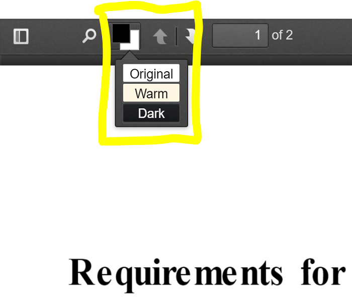

# Invertor

Invertor is a Chrome extension for viewing PDF documents in multiple color themes.

It's based on Mozilla's project [PDF.js](https://github.com/mozilla/pdf.js) for displaying documents in Chrome. The color theme of the PDF can be switched between `Original`, `Dark` and `Warm`.

The original inspiration of this project is to provide better eye protection to people who read PDFs on monitors for long period of time. Moreover, this project is currently planned to improve On-Monitor reading experience by providing extra book-like operations. So that when you use Invertor, you feel like you're physically reading a real book.

Currently, the changes only happened to displaying the document. You can build the project by running the commands given in [PDF.js](https://github.com/mozilla/pdf.js).

## Basic Commands

Run

    $ gulp server

to run the service on your local machine, then open

+ http://localhost:8888/web/viewer.html

to view the sample documents in your browser.

## Overview of the extra functionality provided by this project

Original

Warm

Dark

